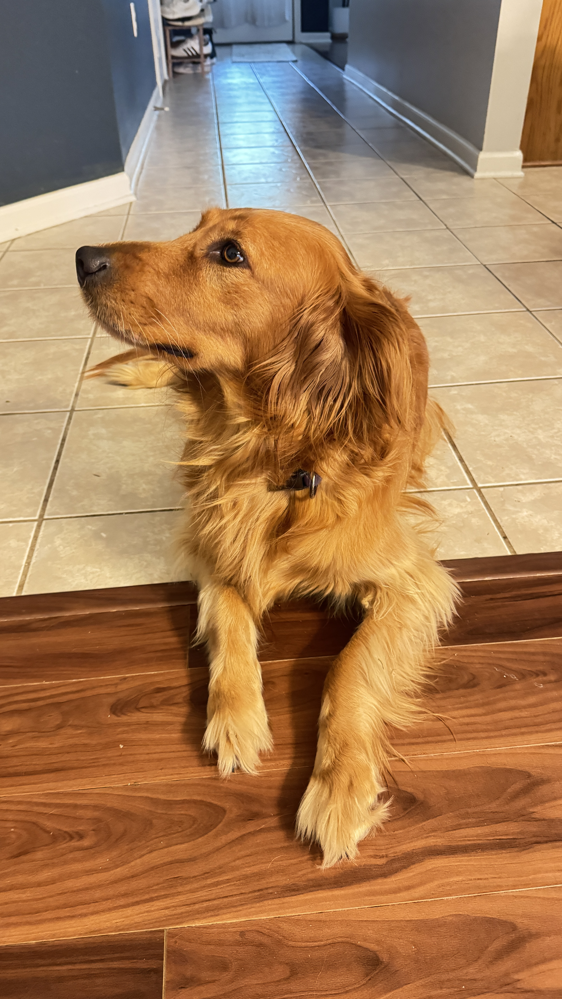

# My Learning Portfolio

Welcome to my GitHub repository where I share my coding journey and projects as a student at *Mississippi State University*.

---

## Plan

This repository is a space for me to grow my programming skills and document my learning. I plan to use [Jupyter](https://jupyter.org) notebooks to create interactive code-based assignments and track progress over time.

## About Me

Hello! I'm Travis, a student and Navy veteran with a background in healthcare. I’m currently studying coding and data science to expand my career opportunities. I’m especially interested in **health technology, leadership, and lifelong learning**.

- Mississippi State University student  
- Healthcare and EMS background  
- Passionate about dogs and coding  
- Exploring data, tech, and innovation  

This is a photo of my dog, Kali. She’s always by my side while I work on school projects and keeps me motivated!

